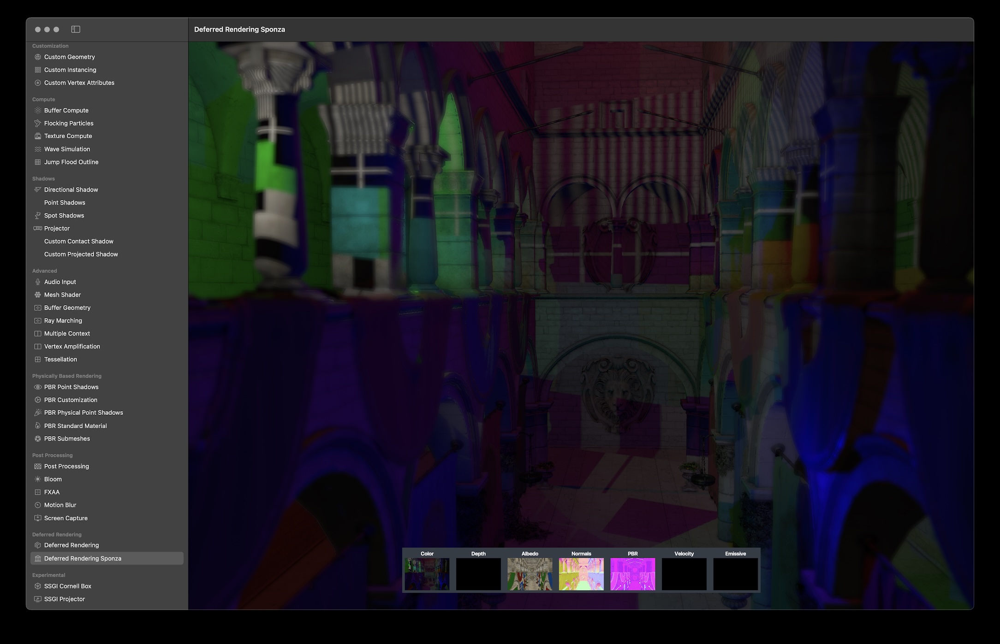
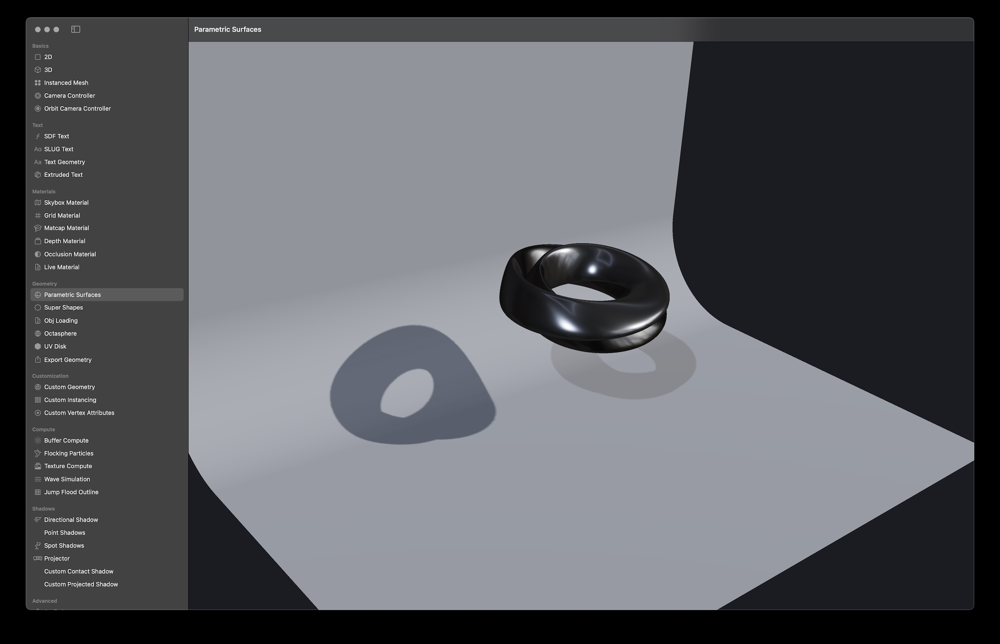
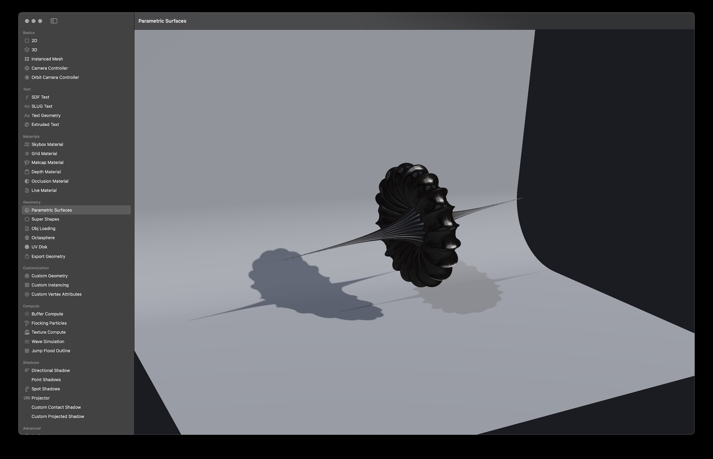
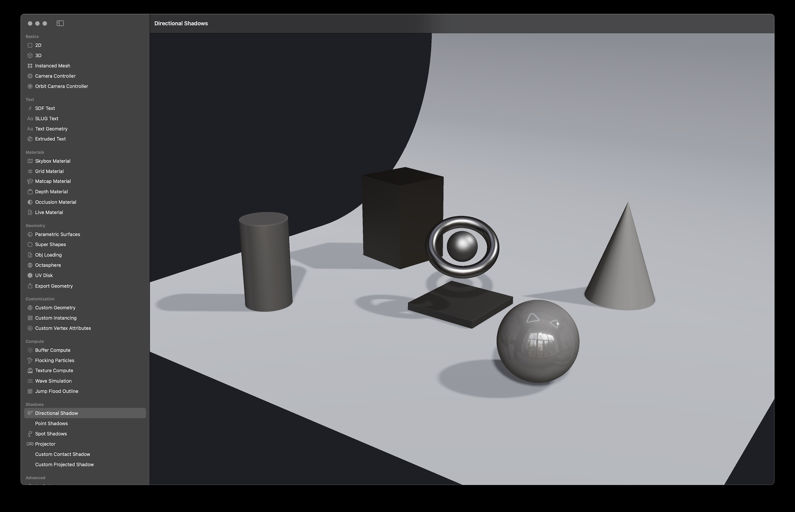
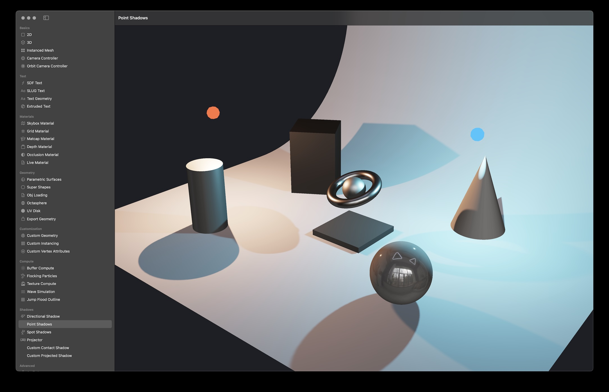
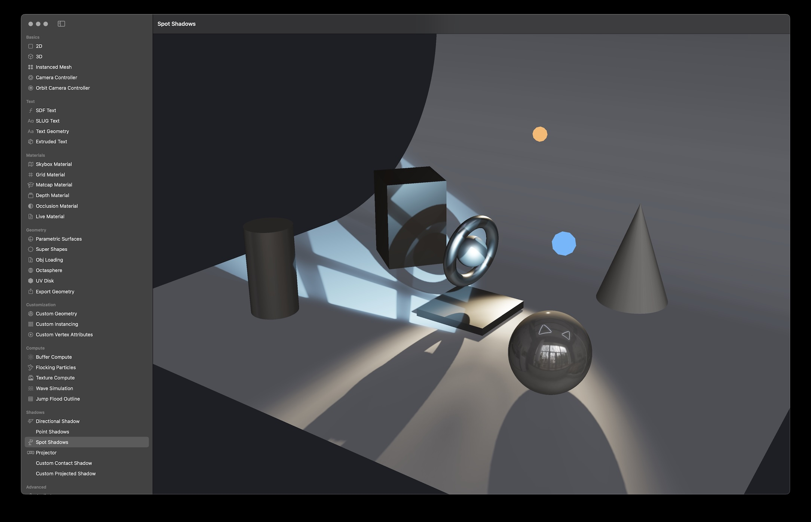
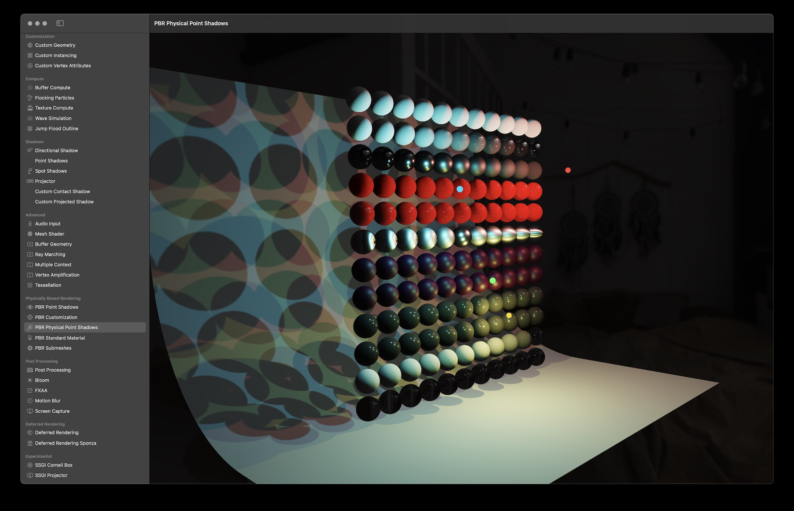

# Satin - A 3D Graphics Framework built on Apple's Metal


# About

Satin is a 3D graphics framework (inspired by threejs) that helps designers and developers work with Apple's Metal API. Satin provides helpful classes for creating meshes, materials, buffers, uniforms, geometries, pipelines (shaders), compute kernels, and more.

Satin makes simple graphics tasks fun and easy to accomplish quickly and complex graphics tasks easier to accomplish without having to write tons of boilerplate code. It does this by providing structure, opinions, and tons of helpful abstractions on Metal to help you get up and rendering / coding in a few minutes. 

Satin is mostly Swift based, however when performing expensive CPU operations, Satin uses SatinCore, which is written in C (for tasks like geometry generation, triangulation, bounds & computational geometry calculations, and more) to make sure things are as fast as possible.


# Supported Platforms

- macOS 15.0+
- iOS 18.0+
- visionOS 2.0+

# Installation

### Swift Package Manager

[Swift Package Manager](https://swift.org/package-manager/) is a tool for automating the distribution of Swift code and is integrated into the `Swift` compiler. Once you have your Swift package set up, adding `Satin` as a dependency is as easy as adding it to the `dependencies` value of your `Package.swift`.

```swift
  dependencies: [
      .package(url: "https://github.com/Fabric-Project/Satin.git", .branch("main"))
  ]
```

# Features

Satin supports modern techniques, like deferred rendering, post processing, instancing, lighting with soft shadows (and projection) model loading and more. 

<!-- <style>
  .carousel-container {
    display: flex;
    overflow-x: auto;
    scroll-snap-type: x mandatory;
    gap: 16px;
    padding-bottom: 16px;
    scrollbar-width: thin; /* Firefox */
  }
  
  /* Hide scrollbar for Chrome/Safari */
  .carousel-container::-webkit-scrollbar {
    display: none;
  }

  .carousel-slide {
    flex: 0 0 100%; /* Shows 1 image at a time */
    scroll-snap-align: center;
    border-radius: 8px;
    overflow: hidden;
  }

  .carousel-slide img {
    width: 100%;
    height: auto;
    object-fit: cover;
    display: block;
  }
</style> -->

<div class="carousel-container" style="display: flex;
    overflow-x: auto;
    scroll-snap-type: x mandatory;
    gap: 16px;
    padding-bottom: 16px;
    scrollbar-width: thin;">
  
  <div class="carousel-slide" style="flex: 0 0 100%;
    scroll-snap-align: center;
    border-radius: 8px;
    overflow: hidden;">
    
  </div>
  <div class="carousel-slide" style="flex: 0 0 100%;
    scroll-snap-align: center;
    border-radius: 8px;
    overflow: hidden;">
    
  </div>
  <div class="carousel-slide" style="flex: 0 0 100%;
    scroll-snap-align: center;
    border-radius: 8px;
    overflow: hidden;">
    
  </div>
  <div class="carousel-slide"  style="flex: 0 0 100%;
    scroll-snap-align: center;
    border-radius: 8px;
    overflow: hidden;">
    
  </div>
  <div class="carousel-slide"  style="flex: 0 0 100%;
    scroll-snap-align: center;
    border-radius: 8px;
    overflow: hidden;">
    
  </div>  <div class="carousel-slide"  style="flex: 0 0 100%;
    scroll-snap-align: center;
    border-radius: 8px;
    overflow: hidden;">
    
  </div>
  <div class="carousel-slide"  style="flex: 0 0 100%;
    scroll-snap-align: center;
    border-radius: 8px;
    overflow: hidden;">
    
  </div>
  <div class="carousel-slide"  style="flex: 0 0 100%;
    scroll-snap-align: center;
    border-radius: 8px;
    overflow: hidden;">
    
  </div>
  <div class="carousel-slide"  style="flex: 0 0 100%;
    scroll-snap-align: center;
    border-radius: 8px;
    overflow: hidden;">
    
  </div>
  <div class="carousel-slide"  style="flex: 0 0 100%;
    scroll-snap-align: center;
    border-radius: 8px;
    overflow: hidden;">
    
  </div>
  <div class="carousel-slide"  style="flex: 0 0 100%;
    scroll-snap-align: center;
    border-radius: 8px;
    overflow: hidden;">
    
  </div>
  <div class="carousel-slide"  style="flex: 0 0 100%;
    scroll-snap-align: center;
    border-radius: 8px;
    overflow: hidden;">
    
  </div>
</div>


- [x] Tons of examples that show how to use the API (2D, 3D, Raycasting, Compute, Exporting, Live Coding, AR, etc).
- [x] Object, Mesh, InstancedMesh, TessellationMesh, Material, Shader, Geometry, Camera and Renderer classes.
- [x] Builtin Materials (BasicColor, BasicTexture, BasicDiffuse, Normal, UV Color, Skybox, MatCap and more).
- [x] PBR Support via Standard & Advanced Physical Materials (Based on Disney's PBR Implementation)
- [x] You can live code shaders.
- [x] Support for Forward, Forward + and Deferred rendering modes with support for multiple render targets.
- [x] Built in Post Processing Techniques (Motion Blur, Depth of Field and Post Processor base class)
- [x] Tons of Geometries (Box, Sphere, IcoSphere, Circle, Cone, Quad, Plane, Capsule, RoundedRect, Text, and more).
- [x] Cameras (Orthographic, Perspective) & Camera Controllers.
- [x] Slug Text Rendering
- [x] Flexible Vertex Structure
- [x] Run-time & Dynamic Struct creation via Parameters for Buffers and Uniforms.
- [x] Metal Shader Compiler (useful when live coding, using #include during runtime)
- [x] Metal Pipeline Caches (Render & Compute)
- [x] Buffer & Texture Compute Systems make running compute kernels a breeze.
- [x] Generators for BRDF LUT, Image Based Lighting (HDR -> Specular & Diffuse IBL Textures)
- [x] Fast raycasting via Bounding Volume Hierachies (very helpful to see what you clicked or tapped on).
- [x] Hooks for custom Metal rendering via Mesh's preDraw, Material's onBind, Buffer & Texture Computes' preCompute, etc
- [x] Hooks for custom rendering via the Renderable protocol
- [x] FileWatcher for checking if a resource or shader file has changed.
- [x] Platform specific examples for iOS / AR Kit integration

# Usage

Satin helps to draw things with Metal. To get up and running quickly without tons of boilerplate code and worrying about triple buffering or event (setup, update, resize, key, mouse, touch) callbacks, The example below shows how to use Satin to render a color changing box that looks at a moving point in the scene.

### Simple Example:

```swift
import SwiftUI
import Satin

// Subclass Satin's Renderer to get triple buffered rendering and
// callbacks for Setup, Update, Draw, Resize and Events
final class SimpleRenderer: MetalViewRenderer {
    // A Satin Renderer handles setting the Content on all the objects in the scene graph
    // and drawing the scene either to a texture or on screen

    // Create a Satin Renderer by passing in a context, scene and camera
    lazy var renderer = Renderer(context: defaultContext)

    // A PerspectiveCamera is used to render the scene using perspective projection
    // All Satin Cameras inherit from Object, so it has
    let camera = {
        let camera = PerspectiveCamera(
            position: [3.0, 3.0, 3.0],
            near: 0.01,
            far: 100.0,
            fov: 45
        )
        camera.lookAt(.zero)
        return camera
    }()

    // An Object is just an empty node in Satin's Scene Graph, it can have children and a parent
    // Objects have a position, orientation, scale and label
    lazy var scene = Object(label: "Scene", [boxMesh])

    // Meshes inherit from Object, so they have all the properties an object has.
    // A Mesh has unique properties like geometry, material and rendering properties
    // To create renderable object aka a Mesh, you passing it a Geometry and Material like so
    let boxMesh = Mesh(
        label: "Box",
        geometry: BoxGeometry(size: 1.0),
        material: BasicDiffuseMaterial(0.75)
    )

    // Create a time variable so we can change things in our scene over time
    var time: Float = 0.0

    // Satin calls setup once after it has a valid MTKView (mtkView)
    override func setup() {
        renderer.setClearColor(.one)
    }

    // Satin calls update whenever a new frame is ready to be updated, make scene changes here
    override func update() {
        // We increment our time variable so we can procedurally set the box mesh's orientation and material color
        time += 0.05
        let sx = sin(time)
        let sy = cos(time)

        // Setting a material property done by using the set function, this modifies the material's uniforms
        boxMesh.material?.set("Color", [abs(sx), abs(sy), abs(sx + sy), 1.0])

        // You can manually an object's position, orientation, scale, and localMatrix. Here I'm using a
        // convenience lookAt function to orient the box to face the point passed from its current position
        boxMesh.lookAt([sx, sy, 2.0])
    }

    // Satin calls draw when a new frame is ready to be encoded for drawing
    override func draw(renderPassDescriptor: MTLRenderPassDescriptor, commandBuffer: MTLCommandBuffer) {
        // To render a scene into a render pass, just call draw and pass in the render pass descriptor
        // You can also specify a render target and render to a texture instead
        renderer.draw(
            renderPassDescriptor: renderPassDescriptor,
            commandBuffer: commandBuffer,
            scene: scene,
            camera: camera
        )
    }

    // Satin calls resize whenever the view is resized
    override func resize(size: (width: Float, height: Float), scaleFactor: Float) {
        // our camera's aspect ratio is set
        camera.aspect = size.width / size.height

        // our renderer's viewport & texture sizes are set
        renderer.resize(size)
        // if you need to render to a custom viewport, you can specify that after the resize call:
        // renderer.viewport = MTLViewport(...)
    }
}

struct ContentView: View {
    var body: some View {
        SatinMetalView(renderer:  SimpleRenderer())
    }
}
```

# Credits

Satin was created by [Reza Ali](https://www.syedrezaali.com) with contributions & feedback from [Haris Ali](https://syedharisali.com/) and [Taylor Holliday](https://taylorholliday.com/) 

Satin is now forked and maintained by the Fabric Project, led by [Anton Marini](https://vade.info)

# License

Satin is released under the MIT license.
